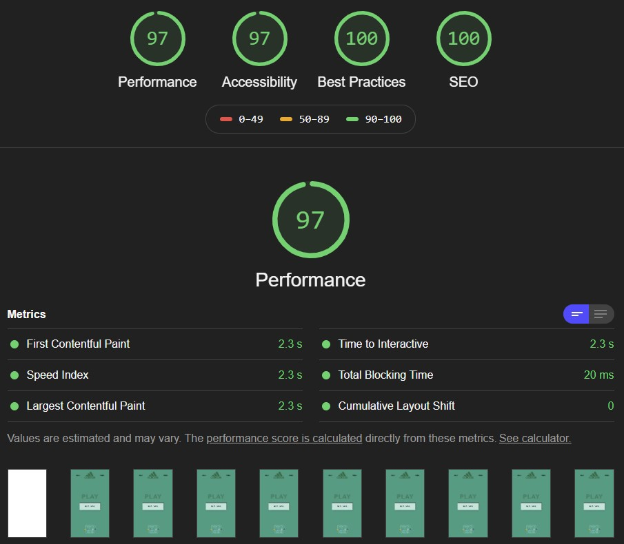

# 🎉 Adidas - Interview

[![Adidas][adidas-src]][adidas-href]
[![Circle CI][circle-ci-src]][circle-ci-href]
[![Dependencies][dependencies-src]][dependencies-href]
[![License][license-src]][license-href]
[![Donate][donate-src]][donate-href]

[adidas-src]: ./public/imgs/logo.png
[adidas-href]: https://www.adidas.com/

[circle-ci-src]: https://img.shields.io/circleci/project/github/LuXDAmore/adidas-interview.svg?style=flat-square
[circle-ci-href]: https://circleci.com/gh/LuXDAmore/adidas-interview

[dependencies-src]: https://img.shields.io/badge/dependencies-up%20to%20date-brightgreen.svg?style=flat-square
[dependencies-href]: https://github.com/LuXDAmore/adidas-interview

[license-src]: https://img.shields.io/badge/license-MIT-brightgreen
[license-href]: https://github.com/LuXDAmore/adidas-interview

[donate-src]: https://img.shields.io/badge/paypal-donate-black.svg?style=flat-square
[donate-href]: https://www.paypal.com/paypalme2/luxdamore

> This project was bootstrapped with [Create React App](https://github.com/facebook/create-react-app).

## 💘 Motivation

This is an interview test code with **React**, made for **Adidas**, you can check the requirements [here](./public/requirements/REACT-Challenge-eCom.pdf).

## Development

1. Clone this repository;
2. Install dependencies using `yarn install` or `npm install`;
3. Start development server using `yarn start` or `npm run start`;
4. Check your codewith `yarn test` or `npm run test`;
5. Build *Github Pages* using `yarn build` or `npm run build` (the content is automatically generated into the `/build` folder).

___

### ReactJs

You can learn more in the [Create React App documentation](https://facebook.github.io/create-react-app/docs/getting-started).

To learn React, check out the [React documentation](https://reactjs.org/).

Please, keep attention to the script `yarn eject`!

**Note: this is a one-way operation. Once you `eject`, you can't go back!**

*If you aren't satisfied with the build tool and configuration choices, you can `eject` at any time. This command will remove the single build dependency from your project. Instead, it will copy all the configuration files and the transitive dependencies (webpack, Babel, ESLint, etc) right into your project so you have full control over them. All of the commands except `eject` will still work, but they will point to the copied scripts so you can tweak them. At this point you're on your own. You don't have to ever use `eject`. The curated feature set is suitable for small and middle deployments, and you shouldn't feel obligated to use this feature. However we understand that this tool wouldn't be useful if you couldn't customize it when you are ready for it.*

## 🐞 Issues

Please make sure to read the [Issue Reporting Checklist](/.github/ISSUE_TEMPLATE/bug_report.md) before opening an issue. Issues not conforming to the guidelines may be closed immediately.

## 👥 Contribution

Please make sure to read the [Contributing Guide](/.github/ISSUE_TEMPLATE/feature_request.md) before making a pull request.

## 📖 Changelog

Details changes for each release are documented in the [**release notes**](./CHANGELOG.md).

### 📃 License

[MIT License](./LICENSE) // Copyright (©) 2019-present [Luca Iaconelli](https://lucaiaconelli.it)

#### 💸 Are you feeling generous today?  :)

Do you want to share a beer? We can be good friends..
__[Paypal](https://www.paypal.me/luxdamore) // [Patreon](https://www.patreon.com/luxdamore)__

> _It's always a good day to be magnanimous - cit_

#### 💼 Hire me

___

#### 💡 Lighthouse

